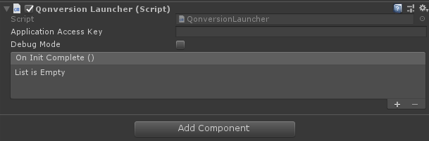

<p align="center">
 <a href="https://qonversion.io" target="_blank"></a>
</p>

<p align="center">
     <a href="https://qonversion.io"></a></p>

Get access to the powerful yet simple subscription analytics:
* Conversion from install to paying user, MRR, LTV, churn and other metrics.
* Feed the advertising and analytics tools you are already using with the data on high-value users to improve your ads targeting and marketing ROAS.

[](https://openupm.com/packages/com.qonversion.unity/)

## Installation

### Unity Package Manager

#### Install via OpenUPM

The package is available on the [openupm registry](https://openupm.com). You can install it via [openupm-cli](https://github.com/openupm/openupm-cli).

```
openupm add com.qonversion.unity
```

#### Install via Git URL

Available starting from Unity 2018.3.

Just add this line to the `Packages/manifest.json` file of your Unity Project:

```json
"dependencies": {
    "com.qonversion.unity": "https://github.com/qonversion/unity-sdk.git#v1.0.0",
}
```

If you want to use a specific [release](https://github.com/qonversion/unity-sdk/releases) in your code, just add `#release` at the end, like so:
```json
"dependencies": {
    "com.qonversion.unity": "https://github.com/lupidan/apple-signin-unity.git#v1.0.0",
}
```

## Plugin setup (Android/iOS)

| Parameters  | Description   |
| -------- | ------------- |
| **Application Access Key**   |  Qonversion [Application Access Key](https://dash.qonversion.io/project/settings), If debug mode set to true, user purchases will be checked on the sandbox environment and will not be sent to third-party integrations.  |
| **Debug Mode**    | Set this to true to view the debug logs. (for development only!)  |

### Setup with a Launcher

<p align="center">
    <a href="./Img/AddEntitlements.png"></a>
</p>

### Programmatic setup with a Script

*RECOMMENDED*

Sample code:
```csharp
using QonversionUnity;

public class QonversionLauncher : MonoBehaviour
{
    private void Start()
    {
        Qonversion.Launch(applicationAccessKey, debugMode);
    }
}
```

## Third-party integrations

### Appsflyer Integration

[Appsflyer Init SDK with deeplinking callbacks] https://github.com/AppsFlyerSDK/appsflyer-unity-plugin/blob/master/docs/Guides.md#-init-sdk-with-deeplinking-callbacks

Sample code:
```csharp
using AppsFlyerSDK;
using QonversionUnity;

public class AppsFlyerObjectScript : MonoBehaviour , IAppsFlyerConversionData
{
    void Start()
    {
        /* AppsFlyer.setDebugLog(true); */
        AppsFlyer.initSDK("devkey", "appID", this);
        AppsFlyer.startSDK();
    }

    public void onConversionDataSuccess(string conversionData)
    {
        AppsFlyer.AFLog("onConversionDataSuccess", conversionData);
        Dictionary<string, object> conversionDataDictionary = AppsFlyer.CallbackStringToDictionary(conversionData);
        // add deferred deeplink logic here
		
        Qonversion.AddAttributionData(conversionData, AttributionSource.AppsFlyer, AppsFlyer.getAppsFlyerId());
    }

    public void onConversionDataFail(string error)
    {
        AppsFlyer.AFLog("onConversionDataFail", error);
    }

    public void onAppOpenAttribution(string attributionData)
    {
        AppsFlyer.AFLog("onAppOpenAttribution", attributionData);
        Dictionary<string, object> attributionDataDictionary = AppsFlyer.CallbackStringToDictionary(attributionData);
        // add direct deeplink logic here
    }

    public void onAppOpenAttributionFailure(string error)
    {
        AppsFlyer.AFLog("onAppOpenAttributionFailure", error);
    }
}
```

## License

Qonversion SDK is available under the MIT license.