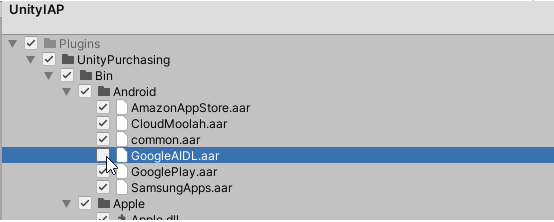
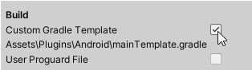
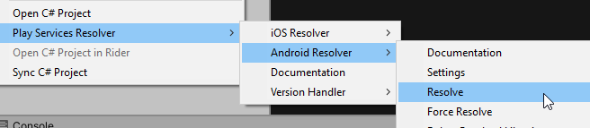

  

  

Get access to the powerful yet simple subscription analytics:

* Conversion from install to paying user, MRR, LTV, churn and other metrics.

* Feed the advertising and analytics tools you are already using with the data on high-value users to improve your ads targeting and marketing ROAS.

  

  

# Simple Installation (including UnitySdkExample):

## 1. Import dependencies
1) Add to your unity project [Unity Dependencies Resolver](https://github.com/googlesamples/unity-jar-resolver#overview) (in UnitySdkExample already imported)
2) Import to your project UnityIAP ([docs](https://docs.unity3d.com/Manual/UnityIAP.html)). While importing UnityIAP uncheck this library 

## 2. Add Qonversion sdk
Import <a  href="./qonversionsdk.unitypackage">qonversionsdk.unitypackage</a> to your project. (in UnitySdkExample already imported)

## 3. Enable custom gradle template

## 4. Resolve android dependencies

## 5. Example using
Check [QonversionUsage.cs](./UnitySdkExample/Assets/Scripts/QonversionUsage.cs)

# License

Qonversion SDK is available under the MIT license.
